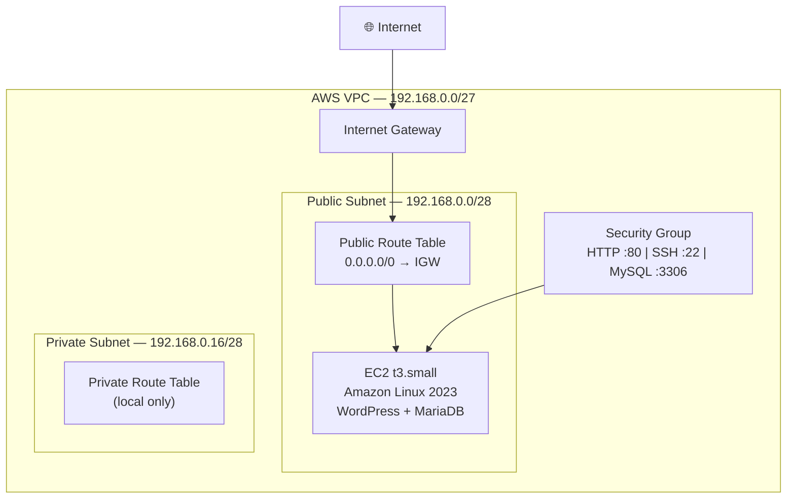

# Deham35 Terraform Capstone — WordPress on AWS

Terraform project that provisions the AWS networking and compute infrastructure needed to host a WordPress site on an Amazon Linux 2023 EC2 instance.

---

## Table of Contents

- [Architecture](#architecture)
- [Resources Provisioned](#resources-provisioned)
- [Prerequisites](#prerequisites)
- [Usage](#usage)
- [Post-Deploy: WordPress Setup](#post-deploy-wordpress-setup)
- [License](#license)

---

## Architecture

```
Internet
    │
    ▼
┌─────────────────────────────────────────────┐
│              AWS VPC                        │
│           192.168.0.0/27                    │
│                                             │
│  ┌──────────────────┐                       │
│  │  Internet Gateway│                       │
│  └────────┬─────────┘                       │
│           │                                 │
│  ┌────────▼────────────────────────────┐    │
│  │      Public Subnet                  │    │
│  │      192.168.0.0/28                 │    │
│  │                                     │    │
│  │  ┌──────────────────────────────┐   │    │
│  │  │  EC2 Instance (t3.small)     │   │    │
│  │  │  Amazon Linux 2023           │   │    │
│  │  │  WordPress + MariaDB         │   │    │
│  │  │  Security Group:             │   │    │
│  │  │    • TCP 80  (HTTP)          │   │    │
│  │  │    • TCP 22  (SSH)           │   │    │
│  │  │    • TCP 3306 (MySQL)        │   │    │
│  │  └──────────────────────────────┘   │    │
│  │                                     │    │
│  │  Route Table → Internet Gateway     │    │
│  └─────────────────────────────────────┘    │
│                                             │
│  ┌─────────────────────────────────────┐    │
│  │      Private Subnet                 │    │
│  │      192.168.0.16/28                │    │
│  │                                     │    │
│  │  (Reserved for future use, e.g.     │    │
│  │   RDS or a dedicated DB instance)   │    │
│  │                                     │    │
│  │  Route Table → (local only)         │    │
│  └─────────────────────────────────────┘    │
└─────────────────────────────────────────────┘
```

> **Mermaid diagram** (rendered on GitHub):



---

## Resources Provisioned

| Resource | Name | Details |
|---|---|---|
| VPC | `wordpress-tf-vpc` | CIDR `192.168.0.0/27` |
| Public Subnet | `public-tf-wordpress-subnet` | `192.168.0.0/28` |
| Private Subnet | `private-tf-wordpress-subnet` | `192.168.0.16/28` |
| Internet Gateway | `wordpress-tf-igw` | Attached to VPC |
| Public Route Table | `public-tf-wordpress-rtb` | Routes `0.0.0.0/0` → IGW |
| Private Route Table | `private-tf-wordpress-rtb` | Local only |
| Security Group | `wordpress-tf-sg` | Allows TCP 80, 22, 3306 inbound; all outbound |
| EC2 Instance | `wordpress-tf-instance` | `t3.small`, Amazon Linux 2023, key pair `vockey` |

---

## Prerequisites

Before running this project, make sure you have the following installed and configured:

### Tools

| Tool | Minimum Version | Install |
|---|---|---|
| [Terraform](https://developer.hashicorp.com/terraform/install) | `>= 1.5` | `brew install terraform` / [download](https://developer.hashicorp.com/terraform/install) |
| [AWS CLI](https://docs.aws.amazon.com/cli/latest/userguide/install-cliv2.html) | v2 | `brew install awscli` |

### AWS Account

- An AWS account with permissions to create VPCs, subnets, EC2 instances, security groups, and internet gateways.
- An EC2 key pair named **`vockey`** must already exist in the target region (or update `key_name` in `main.tf`).
- AWS credentials configured locally — either via environment variables or `aws configure`:

```bash
export AWS_ACCESS_KEY_ID="your-access-key"
export AWS_SECRET_ACCESS_KEY="your-secret-key"
export AWS_DEFAULT_REGION="us-east-1"   # adjust to your region
```

> **Note:** If you are using AWS Academy / Learner Lab, export the session token as well:
> ```bash
> export AWS_SESSION_TOKEN="your-session-token"
> ```

---

## Usage

### 1. Clone the repository

```bash
git clone https://github.com/Kreyno93/Deham35TerraformCapstone.git
cd Deham35TerraformCapstone
```

### 2. Initialize Terraform

Downloads the required AWS provider (v6.39.0).

```bash
terraform init
```

### 3. Preview the changes

```bash
terraform plan
```

### 4. Apply the infrastructure

```bash
terraform apply
```

Type `yes` when prompted. Terraform will output the public IP of the EC2 instance when complete.

### 5. Destroy the infrastructure

When you are done, tear everything down to avoid ongoing charges:

```bash
terraform destroy
```

---

## Post-Deploy: WordPress Setup

After `terraform apply` completes, SSH into the instance using the `vockey` key pair:

```bash
ssh -i /path/to/vockey.pem ec2-user@<public-ip>
```

Then follow the steps in **[setupGuideCapstone.md](./setupGuideCapstone.md)** to:

1. Install and configure MariaDB.
2. Create the WordPress database and user:

   ```sql
   CREATE USER 'wpuser'@'localhost' IDENTIFIED BY 'test123!';
   GRANT ALL PRIVILEGES ON wordpressdb.* TO 'wpuser'@'localhost';
   FLUSH PRIVILEGES;
   EXIT;
   ```

3. Download and configure WordPress.
4. Access your site at `http://<public-ip>`.

---

## License

This project is licensed under the MIT License — see the [LICENSE](./LICENSE) file for details.
